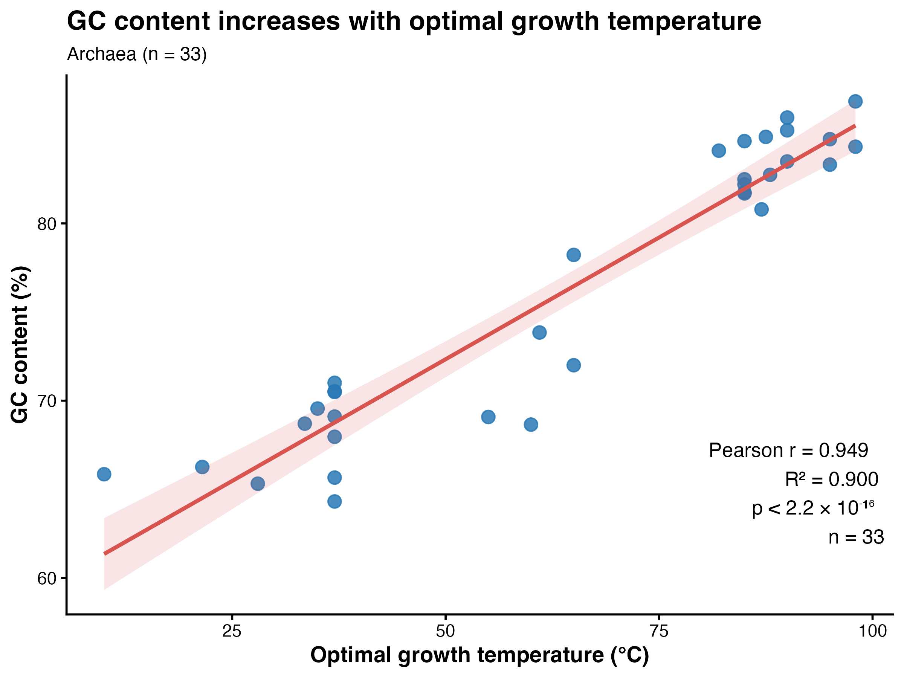

# Temperature and Molecular Evolution in Archaea

## Biological background

Archaea are microorganisms capable of living across a very wide range of environmental temperatures, including extremely hot environments. Environmental temperature can influence molecular evolution and can leave a detectable signal in the molecular composition of organisms.

In particular, the nucleotide composition of ribosomal RNA (rRNA) in Archaea is strongly influenced by temperature. The GC content of rRNA can therefore provide information about adaptation to environmental temperature. Organisms adapted to high temperatures tend to show higher GC content in rRNA than organisms adapted to lower temperatures.

This project is based on the study by Groussin and Gouy (2011), *Adaptation to Environmental Temperature Is a Major Determinant of Molecular Evolutionary Rates in Archaea*. The authors investigated the evolution of optimal growth temperature (OGT) across the archaeal domain and its relationship with molecular evolutionary rates. They used archaeal phylogenies and models of molecular evolution to reconstruct ancestral molecular compositions and optimal growth temperatures. Their results suggest that the last archaeal common ancestor was hyperthermophilic and that environmental temperature has played an important role in the molecular evolution of Archaea.

## Project objective

The objective of this project is to investigate the relationship between optimal growth temperature (OGT) and molecular evolution in Archaea.

As a first step, we examine whether the optimal growth temperature of extant archaeal species is associated with the GC content of their rRNA sequences. We first explore this relationship without considering the evolutionary relationships between species. In a second step, phylogenetic information will be incorporated to determine whether the observed relationship remains when the shared evolutionary history of the species is taken into account.

## Data

The dataset contains 33 archaeal species.

- `data/archaea.nex`: rRNA sequence alignment containing 1801 nucleotide sites.
- `data/archaea.temp`: optimal growth temperature (OGT) for each species.
- `data/archaea.tree`: phylogenetic tree describing the evolutionary relationships among the archaeal species.
- `data/archaea_traits.nex`: continuous dataset containing GC content and OGT for each species.

The 1801 nucleotide positions in the rRNA alignment correspond to double-stranded regions of the rRNA, which are particularly informative for studying the relationship between GC composition and environmental temperature.

## Exploratory analysis: relationship between GC content and temperature

As an initial exploratory analysis, the relationship between GC content and optimal growth temperature was examined without accounting for phylogenetic relationships among species.

Both variables are continuous, so a Pearson correlation was used to evaluate the strength and direction of their linear association. A simple linear regression was also fitted to quantify the relationship between OGT and GC content.

A strong positive association was observed between optimal growth temperature and GC content across the 33 archaeal species (Pearson's r = 0.949, p < 2.2 × 10^-16).

The linear regression explained approximately 90% of the observed variation in GC content (R² = 0.900). Therefore, species adapted to higher optimal growth temperatures tend to have higher GC content in their rRNA sequences.

However, this analysis treats the 33 species as statistically independent observations. Because species share evolutionary history, this assumption may not be valid. Closely related species may have similar GC contents and optimal growth temperatures because of their common ancestry rather than because these traits evolved independently.

The next step of the analysis will therefore incorporate the archaeal phylogeny to determine whether the relationship between optimal growth temperature and GC content remains after accounting for shared evolutionary history.

## Reference

Groussin, M. & Gouy, M. (2011). *Adaptation to Environmental Temperature Is a Major Determinant of Molecular Evolutionary Rates in Archaea*. Molecular Biology and Evolution, 28(9), 2661–2674. https://doi.org/10.1093/molbev/msr098