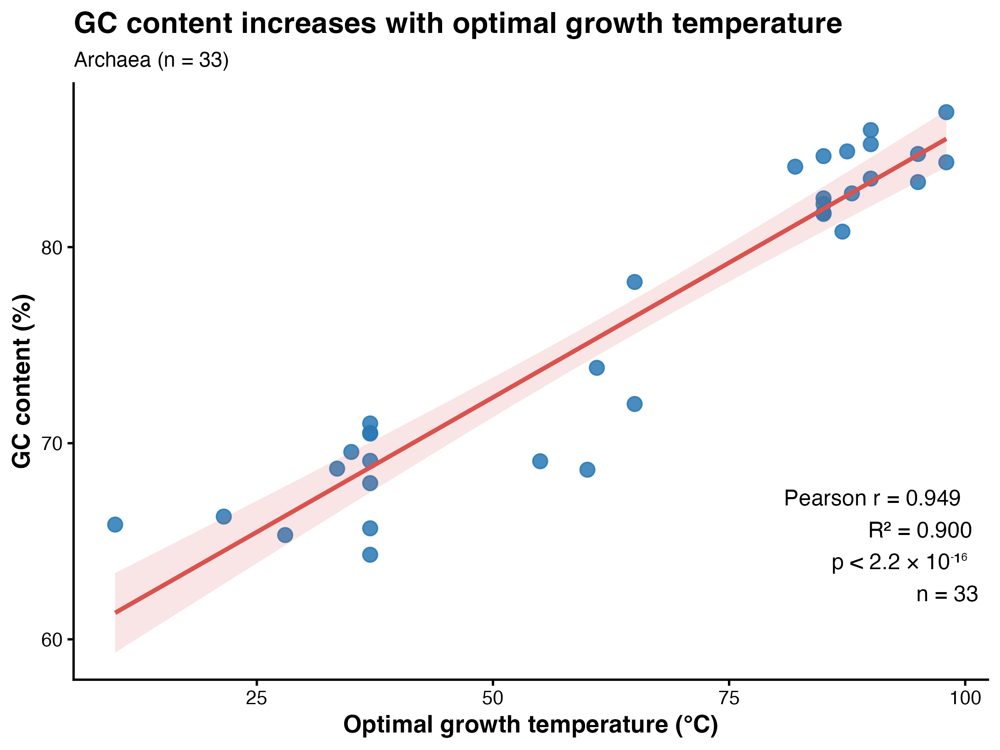

# Temperature and Molecular Evolution in Archaea

## Biological background

Archaea are microorganisms capable of living across a very wide range of environmental temperatures, from mesophilic environments to extremely hot habitats approaching 100°C.

Environmental temperature can leave a detectable signal in molecular composition. In particular, the nucleotide composition of ribosomal RNA (rRNA) in Archaea is strongly associated with optimal growth temperature (OGT). Archaeal species adapted to high temperatures tend to have higher GC content in their rRNA than species adapted to lower temperatures.

This relationship makes rRNA GC content a useful **molecular thermometer**: if GC content and temperature evolve in a predictable way, molecular information may help reconstruct the environmental preferences of ancestral organisms that cannot be observed directly.

This project is based on the study by Groussin and Gouy (2011), *Adaptation to Environmental Temperature Is a Major Determinant of Molecular Evolutionary Rates in Archaea*.

The authors studied the evolution of temperature adaptation across the archaeal domain using phylogenetic and molecular-evolution models. They reconstructed ancestral molecular compositions from rRNA and protein sequences and then used relationships observed between molecular composition and temperature in extant species to infer ancestral optimal growth temperatures.

Their analyses suggested that the common ancestor of the studied Archaea was adapted to high temperatures, supporting a hyperthermophilic origin for the archaeal lineage.

## Research question

The approach used by Groussin and Gouy involves two conceptually separate steps:

1. ancestral molecular compositions are reconstructed;
2. reconstructed molecular values are then related to temperature using a regression calibrated on extant species.

This means that ancestral molecular reconstruction and temperature inference are not estimated simultaneously within the same probabilistic model.

In this project, we instead investigate whether rRNA GC content and optimal growth temperature can be modeled jointly along the archaeal phylogeny.

The main research question is:

> **Can the correlated evolution of rRNA GC content and optimal growth temperature be modeled within a single Bayesian phylogenetic framework in order to estimate both their evolutionary association and ancestral temperatures?**

## Project objectives

The project has two main objectives.

### 1. Estimate the evolutionary association between GC content and temperature

We test whether changes in optimal growth temperature and changes in rRNA GC content tend to occur together along the branches of the archaeal phylogeny.

A Bayesian phylogenetic model implemented in RevBayes is used to estimate the parameter `beta`, which links evolutionary changes in temperature to evolutionary changes in GC content.

A positive value of `beta` indicates that evolutionary increases in temperature tend to be associated with increases in GC content.

### 2. Reconstruct ancestral temperatures

The second objective is to use the joint phylogenetic model to estimate optimal growth temperatures at ancestral nodes of the tree.

Particular attention is given to the temperature at the root of the archaeal phylogeny, which provides information about the thermal environment of the common ancestor represented by the tree.

## Data

The current analysis contains 33 archaeal species.

The `data/` directory contains:

- `data/archaea.nex`: rRNA sequence alignment containing 1801 nucleotide sites for the 33 archaeal species.
- `data/archaea.tree`: phylogenetic tree describing the evolutionary relationships among the 33 archaeal species.
- `data/archaea_temp_gc.nex`: continuous dataset containing optimal growth temperature (OGT) and rRNA GC content for the terminal species.
- `data/rna.itgc`: auxiliary dataset containing a transformed measure related to rRNA GC composition for a broader set of 85 taxa. This file is not directly used in the current RevBayes analysis.

The 1801 nucleotide positions in the rRNA alignment correspond to double-stranded regions of the rRNA. These regions are particularly informative for studying the relationship between nucleotide composition and environmental temperature.

## Exploratory analysis: relationship between GC content and temperature

As an initial validation step, the relationship between rRNA GC content and optimal growth temperature was examined across the 33 extant archaeal species without accounting for their phylogenetic relationships.

Both variables are continuous, so a Pearson correlation was used to evaluate the strength and direction of their linear association. A simple linear regression was also fitted.

A very strong positive association was observed between optimal growth temperature and rRNA GC content:

- Pearson correlation: **r = 0.949**
- p-value: **p < 2.2 × 10^-16**
- R² of the linear regression: **0.900**
- Number of species: **n = 33**

Therefore, archaeal species adapted to higher optimal growth temperatures tend to have higher GC content in their rRNA.

This result is highly consistent with the strong GC-temperature relationship reported by Groussin and Gouy.

However, this exploratory analysis treats the 33 species as statistically independent observations.

This assumption is problematic because species share evolutionary history. Closely related species may have similar temperatures and GC contents partly because they inherited similar characteristics from common ancestors.

For this reason, the main analysis explicitly incorporates the archaeal phylogeny.

## Joint phylogenetic model

The phylogenetic analysis was implemented in **RevBayes**.

The model jointly describes the evolution of optimal growth temperature and rRNA GC content along the phylogenetic tree.

### Evolution of temperature

Temperature is modeled using a Brownian-motion process on the logarithm of temperature.

Using log-transformed temperature ensures that reconstructed temperatures remain positive.

For a branch of the tree, the descendant temperature is modeled as a stochastic modification of the ancestral temperature.

The parameter `sigma_T` controls the amount of evolutionary variation in temperature.

### Evolution of GC content

GC content is modeled on the logit scale.

This transformation ensures that reconstructed GC proportions remain between 0 and 1.

The evolution of GC content is coupled to temperature through the parameter `beta`.

Conceptually, the model can be summarized as:

`change in GC ≈ beta × change in temperature + evolutionary variation`

More precisely, the implemented relationship operates on logit-transformed GC content and log-transformed temperature.

The parameter `sigma_GC` controls the residual evolutionary variation in GC content that is not explained by temperature.

### Interpretation of beta

The main parameter used to evaluate the evolutionary association is `beta`.

- `beta > 0`: increases in temperature tend to be associated with increases in GC content.
- `beta ≈ 0`: there is little evidence for an evolutionary association between the two traits.
- `beta < 0`: increases in temperature tend to be associated with decreases in GC content.

This is therefore different from the simple Pearson correlation calculated across present-day species.

The Pearson correlation describes a **static association among extant taxa**, whereas `beta` describes how changes in the two traits are associated **along the evolutionary history represented by the phylogeny**.

### Molecular sequence information

The model also incorporates the rRNA nucleotide alignment.

Branch-specific T92 substitution matrices are constructed using the reconstructed GC content along each branch.

Consequently, the ancestral GC values are constrained not only by the observed GC values of extant species, but also by the nucleotide substitutions observed in the rRNA alignment.

Temperature, GC content, phylogenetic history and sequence evolution are therefore connected within the same probabilistic model.

## Results

### 1. Exploratory GC-temperature relationship

The non-phylogenetic analysis showed a very strong relationship between GC content and optimal growth temperature:

**Pearson r = 0.949**

This value is very close to the strong correlation reported by Groussin and Gouy and provides an initial validation that the dataset reproduces the expected biological signal.

### 2. Evolutionary association between GC and temperature

The RevBayes analysis estimated the posterior distribution of `beta`.

The 95% credible interval obtained for `beta` was:

**beta: [0.5, 2.8]**

The entire interval is positive.

This result supports a positive evolutionary association between optimal growth temperature and rRNA GC content in the model.

In other words, branches associated with evolutionary increases in temperature also tend to be associated with increases in rRNA GC content.

This result is consistent with the biological relationship observed among present-day archaeal species, while additionally accounting for their shared phylogenetic history.

### 3. Reconstruction of the ancestral root temperature

The model was also used to reconstruct the optimal growth temperature at the root of the phylogeny.

Three analyses were compared in order to examine how GC information and the parameter `beta` influence the reconstruction.

| Scenario | Estimated root temperature |
| --- | ---: |
| Root GC unknown, `beta` active | **80.91°C** |
| Root GC known (~86%), `beta` active | **105.61°C** |
| Root GC known, `beta = 0` | **72.15°C** |

### Scenario 1: root GC unknown and beta active

When the root GC value is not fixed and both temperature and GC are reconstructed jointly, the estimated root temperature is:

**80.91°C**

This reconstruction is consistent with a thermophilic to hyperthermophilic archaeal ancestor and is close to the ancestral temperature range proposed by Groussin and Gouy.

This indicates that the joint model can recover an ancestral thermal signal compatible with the conclusions of the reference study.

### Scenario 2: root GC known and beta active

When information about the root GC content is introduced while keeping the evolutionary coupling between GC and temperature active, the estimated root temperature increases to:

**105.61°C**

This result demonstrates that information about ancestral GC content can propagate through the coupling parameter `beta` and influence the reconstructed ancestral temperature.

However, this estimate is higher than the ancestral temperature estimates reported in the reference study and should therefore be interpreted cautiously.

The difference may reflect the assumptions of our model, particularly the use of a single linear relationship between changes in temperature and GC across the entire phylogeny.

### Scenario 3: root GC known and beta = 0

As a control analysis, `beta` was fixed to zero.

In this model, GC evolution and temperature evolution are no longer coupled.

The estimated root temperature was:

**72.15°C**

The comparison between this analysis and the previous scenario is particularly informative.

When `beta` is active, information about root GC content can influence the reconstructed root temperature. When `beta = 0`, this channel of information between the two traits is removed.

This control therefore confirms that `beta` is the parameter responsible for coupling GC and temperature within the model.

It does not demonstrate biological causality, but it shows how information is transferred between the two evolutionary processes under the assumptions of the model.

## Discussion

Two different levels of association were detected.

First, the exploratory analysis showed a very strong relationship between temperature and GC content across extant species (`r = 0.949`).

Second, the phylogenetic model estimated a positive posterior distribution for `beta`, suggesting that the relationship is also detectable when the evolutionary history of the species is explicitly considered.

The reconstruction of the root temperature provides an additional test of the model.

With root GC left unknown, the estimated ancestral temperature of **80.91°C** is consistent with the hypothesis of a high-temperature archaeal ancestor proposed by Groussin and Gouy.

The control analyses also illustrate an important property of the joint model: information about GC content can contribute to temperature reconstruction only when the two evolutionary processes are connected through `beta`.

This differs from a two-step procedure in which ancestral GC content is reconstructed first and then converted into a temperature estimate using a separate regression.

In the present model, the evolutionary relationship and the ancestral states are estimated jointly within a Bayesian framework.

## Conclusion

The results support a positive evolutionary association between rRNA GC content and optimal growth temperature in Archaea.

The project therefore provides two main results:

1. **GC content and temperature show evidence of associated evolutionary change along the archaeal phylogeny.**

   The posterior distribution of `beta` is positive, with a 95% credible interval of **[0.5, 2.8]**.

2. **The phylogenetic model allows ancestral temperatures to be reconstructed.**

   In the analysis where root GC was not fixed, the estimated root temperature was **80.91°C**, consistent with a high-temperature ancestral archaeal lineage.

The comparison of the three root-temperature analyses further shows that the parameter `beta` acts as the coupling mechanism through which information about GC content can influence temperature reconstruction.

Overall, the model provides a joint Bayesian framework for studying the evolutionary relationship between molecular composition and environmental temperature while simultaneously reconstructing ancestral states.

## Limitations

Several limitations should be considered when interpreting the results.

First, the dataset contains 33 archaeal species and only uses the rRNA molecular signal. Groussin and Gouy also investigated protein composition, providing an additional independent molecular thermometer.

Second, the model assumes a single global relationship between temperature and GC content through one parameter, `beta`, across the entire phylogeny.

The real relationship may be more complex and may vary among archaeal clades.

Third, the estimate of **105.61°C** obtained when the root GC value is fixed is substantially higher than the ancestral temperatures reported in the reference study.

This suggests that ancestral-temperature reconstruction may be sensitive to model assumptions and to the information imposed at the root.

Finally, some deep ancestral parameters may show lower MCMC efficiency than parameters associated with extant taxa. Convergence and effective sample sizes should therefore be checked carefully in Tracer before interpreting individual ancestral reconstructions.

## Future directions

Several extensions could improve the analysis.

- Include protein amino-acid composition as a second independent molecular thermometer.
- Allow the relationship between temperature and GC content to vary among major archaeal clades.
- Compare alternative phylogenetic topologies to evaluate the sensitivity of ancestral reconstructions to tree uncertainty.
- Run longer MCMC analyses or optimize proposal moves for parameters with low effective sample sizes.
- Compare the joint Bayesian reconstruction directly with a two-step GC-to-temperature reconstruction similar to the approach used in the reference study.

## Reference

Groussin, M. & Gouy, M. (2011). *Adaptation to Environmental Temperature Is a Major Determinant of Molecular Evolutionary Rates in Archaea*. Molecular Biology and Evolution, 28(9), 2661–2674.

https://doi.org/10.1093/molbev/msr098